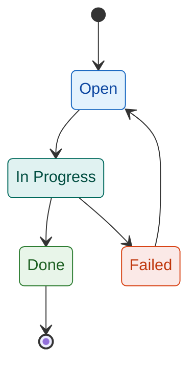
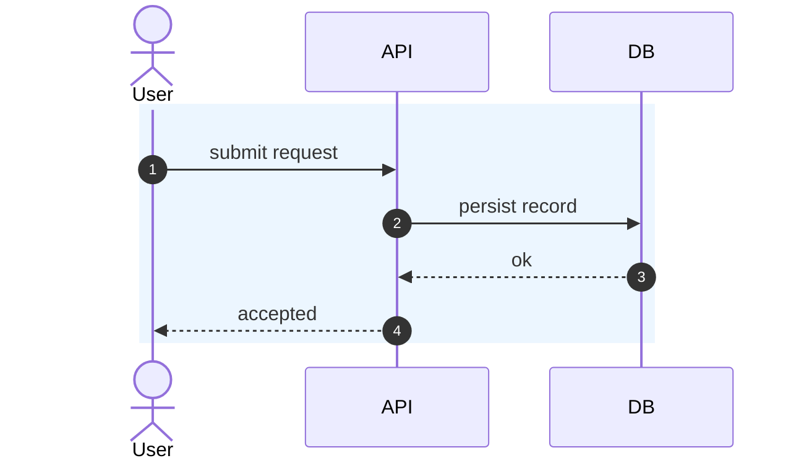
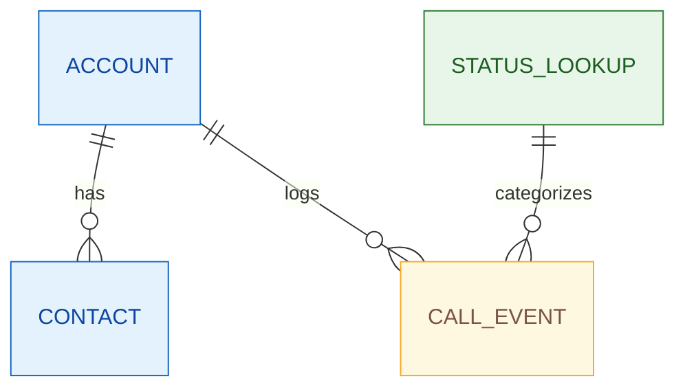

# Codex Org Standards

This document defines the minimum standard for Codex-driven changes across MDSoftware-DE repositories.

## Default Language
English is the default language for:
- Documentation
- GitHub issues
- Pull request titles and descriptions
- Operational run notes

## Required Repo Files
Each active repository should contain:
- `AGENTS.md` with the org baseline block from `docs/codex/AGENTS_BASELINE_BLOCK.md`
- `docs/AGENTS.md` with repository-specific documentation and Mermaid authoring notes (template: `docs/codex/DOCS_AGENTS_TEMPLATE.md`)
- `docs/diagrams/README.md` with Mermaid style guidance (template: `docs/codex/DIAGRAMS_README_TEMPLATE.md`)
- `.github/ISSUE_TEMPLATE/*` aligned with the org baseline
- `.github/workflows/policy-standards.yml` aligned with `docs/codex/workflows/policy-standards.yml`
- `.github/workflows/quality-gate.yml` aligned with `docs/codex/workflows/quality-gate.yml`
- `.github/workflows/security-checks.yml` aligned with `docs/codex/workflows/security-checks.yml`
- `.github/workflows/deterministic-builds.yml` aligned with `docs/codex/workflows/deterministic-builds.yml`
- `.github/workflows/docs-governance.yml` aligned with `docs/codex/workflows/docs-governance.yml`
- `pull_request_template.md` and `CONTRIBUTING.md` aligned with org defaults

## Documentation Structure Baseline
Documentation is standardized around these canonical paths:
- `docs/README.md` (or `docs/index.md`) as entry point
- `docs/architecture/` for architecture-level artifacts
- `docs/diagrams/` for Mermaid diagrams and visual system views
- `docs/runbooks/` for operational procedures and recovery playbooks

When legacy flat files exist (for example `docs/architecture.md`), keep them linked and migrate incrementally.

## Mermaid Quality Baseline
- Do not use `\\n` escape sequences in Mermaid labels.
- Use color mapping in flowcharts (`classDef` + `class`/`style`) for key domains.
- State diagrams must define at least 3 semantic color groups with `classDef`, map states with grouped `class`/`style` assignments, and use semantic class names.
- For better GitHub renderer compatibility in state diagrams, prefer explicit state aliases (`state "Label" as id`) and optional inline class markers (`id:::class`).
- Sequence diagrams must use `autonumber` or explicit contiguous prefixes (`1.`, `2.`, ...), plus colored visual grouping with `rect` or `box`.
- ER diagrams must define color styling via `classDef default`, semantic `classDef` + grouped `class`/`style` assignments, or explicit per-entity `style` mapping.
- For GitHub compatibility in ER diagrams, avoid `stroke-width` and `font-weight` in ER `classDef`/`style` statements; use `fill`, `stroke`, and `color`.
- Prefer diagrams under `docs/diagrams/` and keep them renderer-safe for GitHub.

## State Diagram Styling Guide
Use a semantic palette and adapt color assignment to the process meaning in that specific use case.

Recommended baseline classes:
- `entry` (ingress/new): `fill:#E3F2FD,stroke:#1565C0,color:#0D47A1`
- `active` (in-progress/work): `fill:#E0F2F1,stroke:#00695C,color:#004D40`
- `review` (manual check/wait): `fill:#FFF8E1,stroke:#F9A825,color:#795548`
- `success` (completed): `fill:#E8F5E9,stroke:#2E7D32,color:#1B5E20`
- `error` (failed/problem): `fill:#FBE9E7,stroke:#D84315,color:#BF360C`
- `terminal` (ended/cancelled): `fill:#ECEFF1,stroke:#546E7A,color:#263238`

Mermaid snippet:

## Sequence Diagram Styling Guide
Use visual grouping to make participant phases readable.

Recommended baseline:
- Use `autonumber`.
- Use at least one colored `rect` (or colored `box`) block.
- Keep interaction labels concise and deterministic.

Mermaid snippet:

## ER Diagram Styling Guide
Use semantic table group colors to separate business objects from lookup and audit entities.

Recommended baseline classes:
- `core`: `fill:#E3F2FD,stroke:#1565C0,color:#0D47A1`
- `lookup`: `fill:#E8F5E9,stroke:#2E7D32,color:#1B5E20`
- `event`: `fill:#FFF8E1,stroke:#F9A825,color:#795548`

Mermaid snippet:

## Enforcement Model
- Org defaults live in `MDSoftware-DE/.github`.
- Reusable PR policy workflow source:
  - `.github/workflows/policy-standards-reusable.yml`
- Reusable quality gate workflow source:
  - `.github/workflows/quality-gate-reusable.yml`
- Reusable security checks workflow source:
  - `.github/workflows/security-checks-reusable.yml`
- Reusable deterministic builds workflow source:
  - `.github/workflows/deterministic-builds-reusable.yml`
- Reusable docs governance workflow source:
  - `.github/workflows/docs-governance-reusable.yml`
- Drift detection workflows run from `MDSoftware-DE/nas-hulk-config` and open TOCHECK issues per repository.
- Branch protection baseline is applied where GitHub plan features permit it.
  - Public repositories: enforced.
  - Private repositories on user account plans may require GitHub Pro for branch protection/rulesets.

## Onboarding New Repositories
1. Copy `docs/codex/AGENTS_TEMPLATE.md` to `<repo>/AGENTS.md`.
2. Copy `docs/codex/DOCS_AGENTS_TEMPLATE.md` to `<repo>/docs/AGENTS.md`.
3. Copy `docs/codex/DIAGRAMS_README_TEMPLATE.md` to `<repo>/docs/diagrams/README.md`.
4. Add `.github/workflows/policy-standards.yml` from `docs/codex/workflows/policy-standards.yml`.
5. Add `.github/workflows/quality-gate.yml` from `docs/codex/workflows/quality-gate.yml`.
6. Add `.github/workflows/security-checks.yml` from `docs/codex/workflows/security-checks.yml`.
7. Add `.github/workflows/deterministic-builds.yml` from `docs/codex/workflows/deterministic-builds.yml`.
8. Add `.github/workflows/docs-governance.yml` from `docs/codex/workflows/docs-governance.yml`.
9. Confirm issue templates come from org defaults.
10. Keep `pull_request_template.md` and `CONTRIBUTING.md` aligned with org defaults.
11. Create the first TOCHECK issue only if intentional deviations are required.
