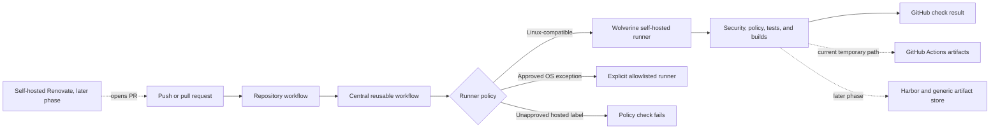

# Organization-Wide Wolverine GitHub Actions Runner Design

**Status:** Approved architecture draft awaiting written-specification approval
**Date:** 2026-07-31
**Tracking issue:** https://github.com/MDSoftware-DE/.github/issues/11
**Initial canary:** https://github.com/MDSoftware-DE/dgx-spark-vision-config/pull/138

## Purpose

Move every feasible GitHub Actions workload in the MDSoftware-DE organization from GitHub-hosted runners to the trusted self-hosted Wolverine runner. Required checks remain enabled, but their execution must no longer depend on GitHub-hosted runner billing, spending limits, or feature activation.

This design covers the first phase only: runner migration and enforcement. Self-hosted artifact storage and dependency-update automation are separate follow-up designs.

## Current Status Snapshot

- Wolverine is the central trusted build runner for MDSoftware-DE repositories.
- HULK, Nightcrawler, Colossus, Vision, and WANDA are deployment or runtime targets unless a repository documents a narrow exception.
- Colossus remains exclusively a runtime, deployment, and monitoring target; Renovate and update pull-request automation belong on Wolverine.
- The five central reusable workflows accept a JSON `runner_labels` input but default to `["ubuntu-latest"]`:
  - `policy-standards-reusable.yml`
  - `docs-governance-reusable.yml`
  - `security-checks-reusable.yml`
  - `deterministic-builds-reusable.yml`
  - `quality-gate-reusable.yml`
- Repository-specific overrides already demonstrate successful Wolverine execution with labels such as `["self-hosted", "wolverine", "vision-config"]`.
- The security jobs on the DGX Spark canary PR are rejected before their first step because their inherited GitHub-hosted runner requires unavailable GitHub billing.
- Existing required security gates must not be disabled or converted into optional checks.
- GitHub Actions artifact storage and Dependabot remain GitHub-managed services even when their related CI jobs execute on Wolverine.
- The central documentation-governance validator already fails on `main` because the repository lacks its declared documentation index, documentation instructions, and canonical documentation directories. Stage 1 must restore that baseline or deliberately align the validator and documented structure before it can serve as acceptance evidence.

## Last Change

On 2026-07-31, the approved architecture was documented and linked to central tracking issue `MDSoftware-DE/.github#11`. No workflow behavior or production runtime was changed by this design document.

## Design Principles

1. Wolverine is the default execution target for every Linux-compatible CI job.
2. Backend selection belongs to one policy layer: central reusable workflows define the organization default, while callers may add repository-specific Wolverine labels.
3. There is no automatic fallback to GitHub-hosted runners.
4. Required quality and security gates remain required.
5. An unavailable or saturated Wolverine runner causes visible queueing, not silent execution on a billed runner.
6. Exceptions are explicit, narrow, documented, and mechanically enforced.
7. Builds happen on Wolverine; deployment targets only receive validated artifacts.
8. The migration must not alter production model, application, or deployment routing.

## Target Architecture



GitHub remains the source-control and check-reporting plane. Wolverine provides compute. Runtime hosts do not become general-purpose CI runners.

## Central Runner Contract

Each central reusable workflow keeps the existing `runner_labels` input so callers can select a more specific Wolverine runner pool. Its default changes from:

```json
["ubuntu-latest"]
```

to:

```json
["self-hosted", "wolverine"]
```

The default means that any consumer which omits `runner_labels` queues only for a self-hosted runner carrying both labels.

A repository may use additional labels when its workload requires an isolated capability:

```json
["self-hosted", "wolverine", "vision-config"]
```

Additional labels refine the Wolverine pool. They must not replace the `self-hosted` and `wolverine` labels with a GitHub-hosted label.

## Migration Scope

### Central reusable workflows

The runner default changes in all five reusable workflows in one central change. Their workflow logic, tool versions, permissions, and required-check names remain stable unless a Wolverine compatibility correction is necessary.

Documentation and workflow-template examples are updated to describe Wolverine as the standard runner instead of Nightcrawler or `ubuntu-latest`.

### Repository workflows

An organization-wide inventory classifies every `runs-on` declaration:

- central reusable workflow call;
- explicit Wolverine job;
- GitHub-hosted Linux job;
- Windows or macOS job;
- other self-hosted runner;
- generated or vendored example that does not execute.

Linux-compatible GitHub-hosted jobs are migrated in controlled repository batches. Direct jobs use at least:

```yaml
runs-on: [self-hosted, wolverine]
```

Callers of central reusable workflows normally rely on the central default. They use an explicit `runner_labels` override only when a repository-specific label is required.

### First canary

`MDSoftware-DE/dgx-spark-vision-config#138` is the first security-workflow canary because its policy, quality, and deterministic-build jobs already run successfully on Wolverine while its inherited security jobs demonstrate the billing failure.

The canary is successful only when Semgrep and Gitleaks start on Wolverine, execute non-empty step logs, and pass according to the existing security policy.

## Enforcement

A central guardrail scans active workflow YAML for GitHub-hosted labels, including versioned Ubuntu labels and the standard Windows and macOS hosted labels.

The guardrail follows these rules:

- unapproved GitHub-hosted labels fail the policy check;
- `self-hosted` alone is insufficient for organization-wide build jobs because it does not prove Wolverine ownership;
- the normal contract requires both `self-hosted` and `wolverine`;
- repository-specific Wolverine labels are allowed in addition to the two required labels;
- reusable workflow inputs and expressions are validated separately from literal `runs-on` values;
- comments, examples, generated files, and inactive archives are classified so they cannot create misleading violations.

The allowlist is stored centrally and records, for each exception:

- repository and workflow path;
- exact job;
- required operating system or hosted capability;
- accountable owner;
- approval reference;
- review or expiry date.

An exception is appropriate only when a job genuinely requires an operating system or capability unavailable on Wolverine. Cost or convenience alone is not an exception.

## GitHub Feature Boundaries

### Security scanning

Moving a job to Wolverine removes hosted runner compute billing but does not unlock paid GitHub Code Security features for private repositories. The baseline therefore uses tools that execute locally on Wolverine, including the existing Semgrep and Gitleaks checks. Trivy or OSV-Scanner may be added through a separately reviewed change.

Security findings may be reported through ordinary job logs and check results. SARIF upload is used only when the repository's GitHub plan supports it; lack of paid SARIF features must not prevent the underlying scanner from running.

### Dependency updates

Dependabot is a GitHub service and cannot be redirected to execute as a Wolverine service. Pull-request checks triggered by Dependabot can run on Wolverine, but Dependabot itself remains externally controlled.

Replacing Dependabot with self-hosted Renovate on Wolverine is a separate phase. This runner migration neither disables Dependabot nor claims to make it self-hosted.

The boundary is documented in Colossus PR https://github.com/MDSoftware-DE/vps-colossus-config/pull/326 at commit `e23466d01937c1b9fd017e2223cbc19f7fb1faab` and Wolverine PR https://github.com/MDSoftware-DE/vps-wolverine-config/pull/144 at commit `7ee75dcb01740a5c2896af8db0124bef56beb1a2`. Existing tracking issue https://github.com/MDSoftware-DE/vps-wolverine-config/issues/143 is authoritative; this phase must not create a duplicate Renovate issue or implement Renovate or Watchtower.

### Artifacts

`actions/upload-artifact` and `actions/download-artifact` use GitHub-managed artifact storage even when the producing job runs on Wolverine. They remain temporarily supported so runner migration is not coupled to storage migration.

A separate design will introduce:

- Harbor for container images and other OCI artifacts;
- a generic self-hosted artifact store for files that do not fit the OCI model;
- retention, immutability, access control, backup, and cleanup policies;
- migration away from GitHub artifact quotas where practical.

## Wolverine Operational Requirements

The Wolverine runner fleet must provide:

- the labels `self-hosted` and `wolverine`;
- enough capacity for required checks to complete without persistent starvation;
- a clean or isolated workspace between jobs;
- the toolchain required by central workflows;
- Docker access for workflows that use containers, with a documented privilege boundary;
- outbound access required for source dependencies and vulnerability databases;
- protected credentials scoped to the minimum repositories and environments;
- monitoring for online state, busy state, queue age, disk space, and failed cleanup;
- controlled updates and a rollback path for runner software and build toolchains.

Repository-specific labels may divide capacity by trust or capability. They do not make Vision, WANDA, HULK, Nightcrawler, or Colossus general build runners.

## Queue and Failure Behavior

If no matching Wolverine runner is online, a job remains visibly queued. It must not change to a GitHub-hosted runner automatically.

Operational alerts should distinguish:

- no matching runner online;
- all matching runners busy;
- job startup failure;
- toolchain or container failure after startup;
- workflow policy rejection;
- artifact upload failure.

Long queue age is an infrastructure incident, not a reason to bypass required checks. Emergency exceptions require an explicit, reviewed repository change and cannot silently activate GitHub billing.

## Rollout

### Stage 1: Central default and canary

1. Restore or deliberately align the central documentation-governance baseline so its validator passes.
2. Validate Wolverine runner labels and required toolchains.
3. Change all central reusable defaults to `["self-hosted", "wolverine"]`.
4. Add the hosted-runner policy guardrail.
5. Run central workflow validation.
6. Re-run the DGX Spark security checks as the first canary.

### Stage 2: Central consumers

Inventory every repository calling a central reusable workflow. Confirm that inherited jobs execute on Wolverine and record repository-specific overrides.

### Stage 3: Direct repository workflows

Migrate direct Linux-compatible `runs-on` declarations in repository batches. Each batch preserves required check names and verifies at least one real workflow run.

### Stage 4: Exceptions and closure

Document unavoidable operating-system exceptions, remove temporary migration entries, and make the guardrail the ongoing organization standard.

## Rollback

Rollback must preserve the no-GitHub-billing requirement.

If a central default causes incompatibility:

1. keep the central default on Wolverine;
2. pause the affected consumer or give it an explicit compatible Wolverine label;
3. repair the runner image, toolchain, permissions, or workflow;
4. re-run the canary before resuming the batch.

Restoring `ubuntu-latest` is not the standard rollback. A true hosted-runner exception requires explicit owner approval and a documented allowlist entry.

Workflow changes do not recreate, restart, or reroute production services. Production rollback is therefore outside this phase.

## Verification and Acceptance

The implementation is accepted when all of the following evidence exists:

1. YAML parsing and workflow syntax validation pass for the central reusable workflows and templates.
2. `actionlint` passes when available in the validated Wolverine toolchain.
3. A source scan finds no unapproved GitHub-hosted runner labels in active organization workflows.
4. All five reusable workflow defaults resolve to `["self-hosted", "wolverine"]`.
5. The DGX Spark canary's Semgrep and Gitleaks jobs start on Wolverine, contain real executed steps, and pass.
6. The canary's existing policy, quality, and deterministic-build checks remain green.
7. A deliberately invalid hosted-runner fixture proves that the policy guardrail fails.
8. An approved exception fixture proves that exact allowlist matching works without broadly suppressing other violations.
9. Consumer repositories are migrated in recorded batches with links to successful runs.
10. No production or runtime host state changes as part of the runner migration.

## Quick Test

From the central `.github` repository:

```sh
python .github/scripts/validate_docs_governance.py
rg -n --glob '*.yml' --glob '*.yaml' 'runs-on:.*(ubuntu-|windows-|macos-)' .github
git diff --check
```

During implementation, the dedicated runner-policy validator and its fixtures become the authoritative hosted-runner check. The `rg` command remains a quick human diagnostic and does not replace structured YAML validation.

## Maintenance Rule

All new Linux-compatible organization workflows must run on labels containing both `self-hosted` and `wolverine`, directly or through a central reusable workflow. Any exception must be added to the central allowlist with an owner, evidence, approval reference, and review date. Changes to the central runner contract require a canary run before organization-wide rollout.

## Follow-Up Designs

The following approved directions remain separate so Phase 1 can be implemented and verified without coupling it to infrastructure procurement or service migration:

1. Harbor plus a generic self-hosted artifact store, including build publication, retention, backup, access control, and consumer migration.
2. Self-hosted Renovate on Wolverine as a possible Dependabot replacement, including scheduling, GitHub App permissions, update policy, grouping, and rollback.

Each follow-up requires its own design approval, implementation plan, tracking issue, and acceptance evidence.
